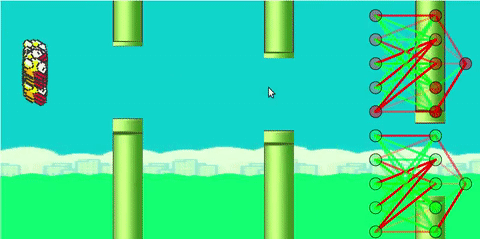

# FlappyBirdOnJavascript
Improved flappy bird learns through neuroevolution.
To start, open index.html on any browser. Use the slider for making the training fast.I used P5.js library here for JavaScript. On the right hand side is the neural Network of the fittestBirdOfPreviousGame on top and fittestBirdinCurrentGame at bottom.
Except for the p5.min.js and p5.dom.js, the entire project is self made.
Crossover is not used.
the Selection of parents is based such the in the new generation only those members are to be passed whose fitness is more than the average fitness value of the entire previous Population.
Mutation rate is set to 0.01.
Fitness is designed such that the score as well as the distance between the nearest pipe and the bird is also taken into account.

## To see it work on your browser, go to:
https://nishantkr18.github.io/FlappyBirdOnJavascript/
